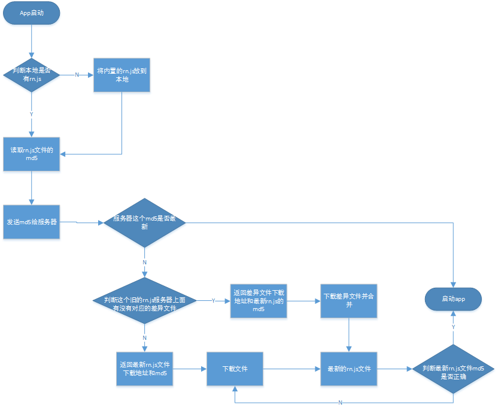

# React Native Horse Push (深圳金马 root#68xg.com)
集成了灰度部署，但是需要再后端实现，这里因为没有时间就先写差异更新，
文档肯定写的不好，我有空再写详细点，有啥问题加qq群389969823
就不装逼写那么多英文了，给国人看的都中文吧
这是一个中国式的react native更新 他包含 apk 与 js的差异更新
并且支持灰度部署，需要通过后端实现。
这个插件已经在app端实现了所有需要的功能了，后端我还在写，如果你很急可以根据你的业务逻辑写下你的后端，到时候后端会放出。
这里我会给你后端如何返回数据的一个简单demo。




## 具体原理看优酷视频第46分钟开始 http://v.youku.com/v_show/id_XMTUxOTE5MzQwNA==.html

	把这个项目下载下来，在你的程序引入这个依赖包
	
	在安卓的assets文件夹下面放置你的js bundle文件，文件名一定要为 horse.push.js，就是我们的基础，因为我们的差异更新必须有一个基础包，在你发布到时候的时候你可以内嵌一个最新的jsbundle包就可以了


* 创建安卓程序的application (in Application.java)

```java
	public void onCreate() {
	HorsePush.getInstance(getApplicationContext(), "http://you.server/horsepush", "you_channel");// <------ 加入这个代码
    }
	
```


* 修改 MainActivity (in MainActivity.java)

```java

    protected void onCreate(Bundle savedInstanceState) {
        startActivity(new Intent().setClass(getApplicationContext(), HorsePushStartPage.class));// <------ 加入这个代码，使用启动屏
    }


    protected String getJSBundleFile() {
        return HorsePush.getJSBundleFile(this); // <------ 加入这个代码告诉rn通过本地启动
    } 

    protected void onResume() {
        HorsePush.reCheckUpdate();//<------每次从后台返回都会尝试更新
    }
}
```


## 生成差异文件 

	通过 bsdiff生成，这两天没空，我会更新的，很简单的你自己研究下bsdiff的用法

## Usage

	每次打开app的时候都会请求你在application里面写的接口，由接口返回更新数据，数据格式如下,
	每次会吧自己的app版本号和渠道号和js的md5传送给服务器，由服务器返回的数据决定是差异更新还是完整更新，
	如果差异更新里面字段有内容就用差异更新进行更新，
	
	{
		"code": 200,
		"msg": "获取成功",
		"data": {
			"javaVersionCode": 0,
			"javaVersionInfo": "发现新的apk版本",
			"javaForceUpdate": false,
			"javaPatchDownlink": "http://you.server/patch.apk",
			"javaDownlink": "http://you.server/newversion.apk",
			"javaDownlinkMd5": "you apk md5",
			"jsVersionInfo": "欢迎使用xxx，点击确定进入最新版",
			"jsForceUpdate": false,
			"jsPatchDownlink": "http://you.server/patch.js",
			"jsDownlink": "http://you.server/newversion.js",
			"jsDownlinkMd5": "you js md5",
			"startpageimg": "http://you.server/startpageimg.jpg",
		}
	}
	
	
	
	
	
